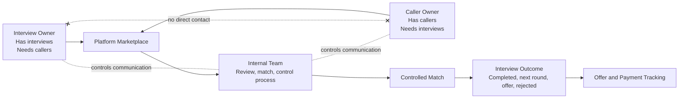
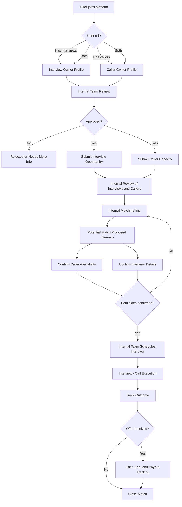
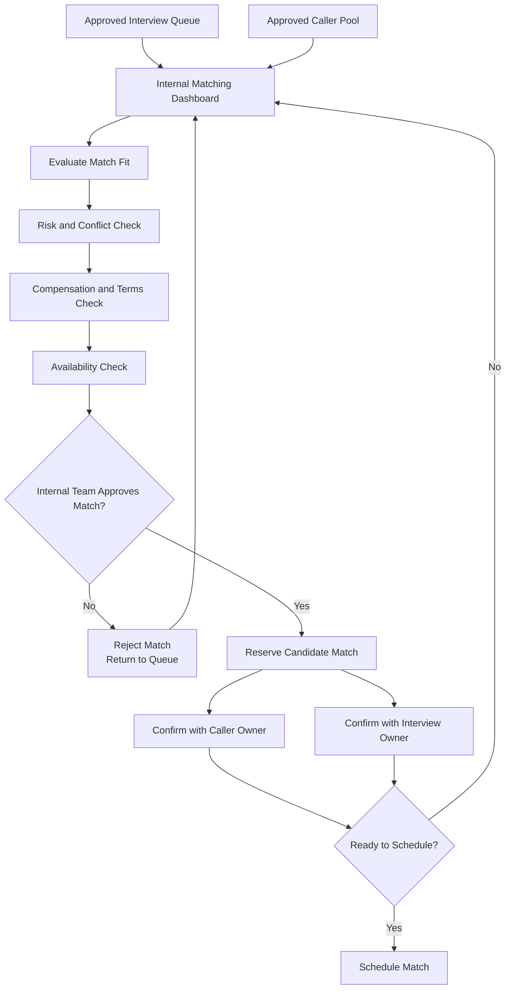
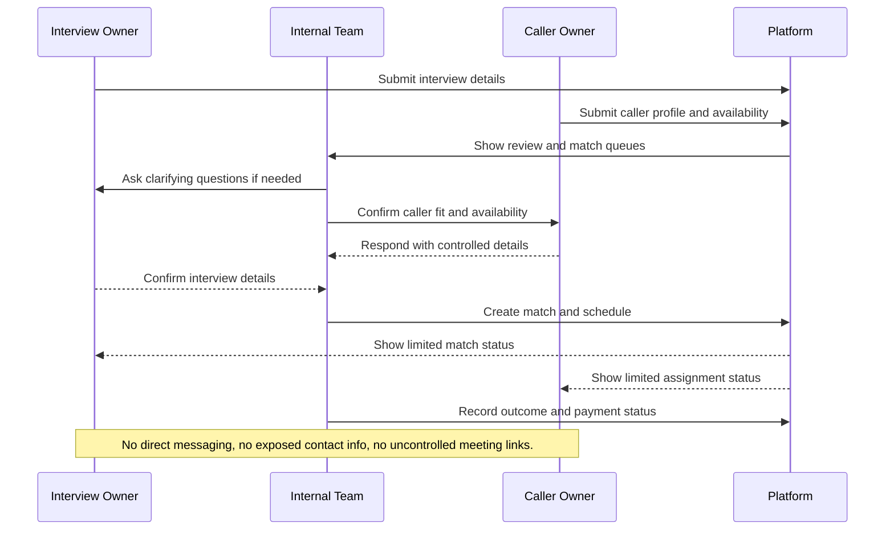
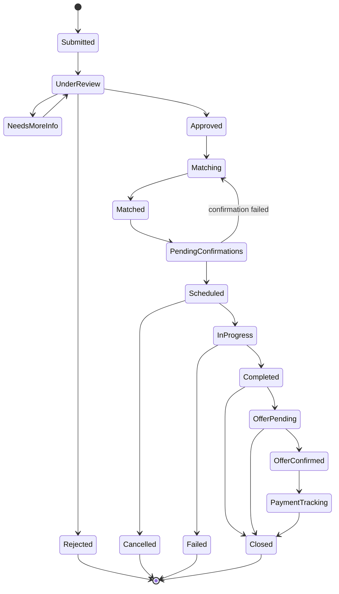

# Interview and Caller Marketplace Workflow

## Concept

This marketplace connects two user groups through an internal managed process:

- Interview owners have interview opportunities and need callers.
- Caller owners have caller capacity and need interview opportunities.
- The internal team reviews, matches, schedules, monitors, and closes each match.
- Interview owners and caller owners should not directly contact each other through the platform.

## Diagram 1: Marketplace Overview

## Diagram 2: End-to-End Business Workflow

## Diagram 3: Internal Matchmaking Process

## Diagram 4: Communication Control

## Diagram 5: Status Model

## Key Platform Modules

### Admin Modules

- User review queue
- Interview opportunity review queue
- Caller profile and availability queue
- Matchmaking dashboard
- Match detail page
- Scheduling controls
- Internal notes
- Risk flags
- Outcome tracking
- Offer and payment tracking

### Interview Owner Modules

- Submit interview opportunity
- View interview review status
- View matching status
- View scheduled interview status
- Submit questions or updates to internal team
- View final outcome when approved by internal team

### Caller Owner Modules

- Submit caller profile
- Submit availability
- View approved assignments
- Confirm availability
- View schedule
- Submit post-interview notes
- View payout status

## Suggested Data Objects

### User

- ID
- Name
- Email
- Role: interview owner, caller owner, both, internal admin
- Review status
- Risk status
- Internal notes

### Interview Opportunity

- ID
- Interview owner ID
- Job title
- Company
- Interview stage
- Interview format
- Time zone
- Availability windows
- Required caller skills
- Budget or compensation terms
- Notes
- Review status
- Match status

### Caller Profile

- ID
- Caller owner ID
- Caller label or name
- Skills
- Languages
- Experience
- Time zone
- Availability windows
- Preferred job categories
- Rate expectation
- Review status
- Availability status
- Performance notes

### Match

- ID
- Interview opportunity ID
- Caller profile ID
- Assigned internal owner
- Match status
- Scheduled time
- Meeting link visibility
- Internal notes
- User-visible notes
- Outcome
- Offer status
- Payment status

### Offer / Payment Record

- ID
- Match ID
- Offer amount
- Offer terms
- Platform fee
- Interview owner fee or revenue
- Caller owner payout
- Payment status
- Payout status
- Closed date

## Business Rules

- Users cannot directly browse the opposite marketplace side.
- Interview owners cannot directly message caller owners.
- Caller owners cannot directly message interview owners.
- Contact information must be hidden by default.
- Meeting links should be controlled by the internal team.
- Internal approval is required before a user can participate.
- Internal approval is required before an interview or caller profile becomes matchable.
- Internal approval is required before a match is scheduled.
- Internal team owns final outcome and offer/payment tracking.
- Risk flags should block automatic matching.
- Cancelled, failed, and no-show matches should affect future review decisions.

## MVP Workflow

1. User signs up and selects a role.
2. Internal team reviews and approves the user.
3. Interview owners submit interview opportunities.
4. Caller owners submit caller profiles and availability.
5. Internal team reviews submitted interviews and callers.
6. Internal team creates a match.
7. Internal team confirms both sides separately.
8. Internal team schedules the interview.
9. Internal team records completion and outcome.
10. If there is an offer, internal team tracks payment and payout.
11. Internal team closes the match.

## Later Enhancements

- Match score calculation
- Availability calendar integration
- Internal-only chat history
- User-visible sanitized message relay
- Caller performance scoring
- Interview owner reliability scoring
- Automated conflict checks
- Same-company duplicate checks
- Payment provider integration
- Admin audit log
- Offer pipeline analytics
- Marketplace liquidity dashboard
